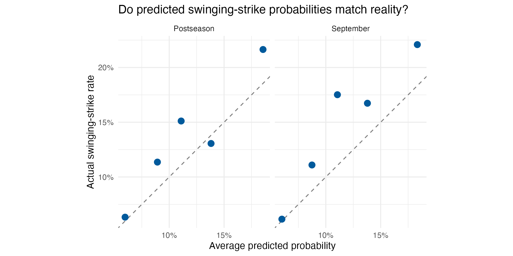

# Predicting Swinging Strikes: 2025 Dodgers

An R project estimating the probability that a pitch thrown by a Dodgers pitcher produces a swinging strike, using its speed, movement, location, count, and batter–pitcher handedness.

## Question

Can pitch characteristics predict swinging strikes more effectively than assigning every pitch the same probability?

## Data

Pitch-level Statcast data downloaded from Baseball Savant for the Dodgers’ entire 2025 regular season and postseason.

- Original data: 24,107 regular-season pitches and 2,706 postseason pitches.
- Removed duplicate pitch records, bunt outcomes, and missing outcomes.
- Removed rows missing any model variable.
- Final modeling dataset: 26,588 pitches.

A swinging strike is defined as `swinging_strike` or `swinging_strike_blocked`. Other retained outcomes, including called strikes and foul tips, are coded as zero.

## Approach

I compared two logistic regression models with a constant-probability baseline.

Both models use:

- Release speed
- Horizontal and vertical movement
- Horizontal and vertical plate location
- Balls and strikes before the pitch
- Whether the batter and pitcher have the same handedness

The second model adds squared location terms to allow curved relationships between pitch location and swinging-strike probability.

### Chronological evaluation

- **Training:** regular-season pitches before August 1.
- **Validation:** August pitches, used to select the model.
- **Final fitting:** training and validation data combined.
- **Testing:** September and postseason pitches, evaluated separately.

The baseline uses the swinging-strike rate from the fitting data.

## Results

Lower Brier scores indicate better probability predictions.

### August validation

| Approach | Brier score |
|---|---:|
| Constant baseline | 0.108092 |
| Simple logistic regression | 0.106444 |
| Logistic regression with squared location terms | 0.105869 |

The model with squared location terms had the lowest validation Brier score and was selected for final evaluation.

### Held-out evaluation

| Period | Pitches | Baseline Brier score* | Model Brier score* | Relative error reduction |
|---|---:|---:|---:|---:|
| September | 3,738 | 0.127 | 0.123 | 2.54% |
| Postseason | 2,682 | 0.117 | 0.115 | 2.02% |

*Brier scores are rounded. Error reductions were calculated using unrounded scores.*

The selected model modestly outperformed the baseline in both test periods. These percentages describe reductions in Brier score, not classification accuracy.

## Calibration



Each point represents one of five groups of predictions within a test period. The dashed line shows where average predicted probability equals the observed swinging-strike rate.

Most points are above the line, indicating that the model often underestimated swinging-strike probabilities in these test periods.

## Limitations

- This analysis covers one team and one season; performance on other teams or years is unknown.
- Actual pitch movement and plate location are observed after a pitch is thrown. This model estimates outcomes conditional on those characteristics.
- The model does not include player identity, pitch type, or previous pitches.
- Repeated pitches within games and players may be related; the model does not explicitly account for this dependence.
- Uncertainty around the measured improvements has not yet been estimated.
- Associations between pitch characteristics and outcomes do not establish causation.

## How to run

1. Open the RStudio project.
2. Install tidyverse once if needed:

```r
install.packages("tidyverse")
```

3. Place the pitch-level Baseball Savant downloads in `data/` with these names:

- `dodgers_2025_regular.csv`
- `dodgers_2025_postseason.csv`

Use 2025, Dodgers, and pitcher filters. Download regular season and postseason separately, retaining all pitch types and pitch results.

4. Run from the project folder:

```r
source("analysis.R")
```

The script creates the calibration chart and results CSVs.

## Files

- `analysis.R`: data preparation, modeling, and evaluation
- `figures/calibration.png`: calibration chart
- `results/final_results.csv`: held-out performance
- `results/calibration.csv`: data underlying the calibration chart

## Data source

[MLB Baseball Savant](https://baseballsavant.mlb.com/statcast_search)

## Author

Samuel Cerda